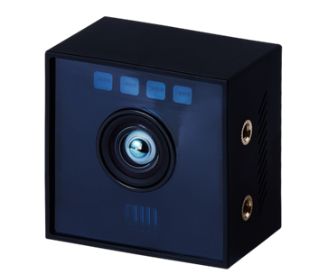

<h1 align="left">
  
</h1>

## LiDAR 
>### [CygLiDAR - D1](https://github.com/CygLiDAR-ROS)
><h1 align="left">
>  
></h1>
>
> #### OPENSOURCE CODE
>
> ###### [✔ (WINDOW) CygLiDAR D1 VIEWER](https://www.cygbot.com/downloads)
>
> ###### [✔ ROS1 / ROS2 SDK Package](https://github.com/CygLiDAR-ROS/cyglidar_d1)
> 
> ###### [✔ Python Examle](https://github.com/CygLiDAR-ROS/cyglidarPython)
------------------------
